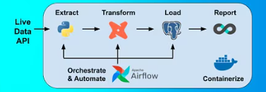

# Weather Data ETL + Analytics

A complete local **ETL + Analytics** pipeline that extracts real-time weather data from the [Weatherstack API](https://weatherstack.com/), loads it into PostgreSQL, transforms it with dbt, orchestrates everything via Apache Airflow, and visualizes insights with Apache Superset.

Built as a self-contained development environment using Docker Compose.

## Project Overview

This project collects current weather observations (temperature and wind) from locations worldwide via the **Weatherstack** REST API.

The data is:
- Extracted periodically using Airflow DAGs
- Loaded (inserted) into a PostgreSQL database
- Transformed / modeled using dbt
- Ready for exploration and dashboarding in Superset

Everything runs locally with no cloud dependencies except the Weatherstack API itself.

### Architecture

### Tech Stack

| Component       | Tool / Image                          | Purpose                              | Port (host) |
|-----------------|----------------------------------------|--------------------------------------|-------------|
| Database        | PostgreSQL 15                          | Stores raw & transformed weather data | 5000       |
| Orchestration   | Apache Airflow 3.1.6 (standalone)      | Schedules & runs ETL pipelines       | 8000       |
| Transformations | dbt-core (dbt-postgres 1.9)            | Builds clean, versioned data models  | —          |
| Visualization   | Apache Superset 3.0.0                  | Dashboards, charts, explorations     | 8088       |
| Cache/Broker    | Redis 7                                | Superset caching & async tasks       | 6379 (localhost only) |
| Containerization| Docker Compose                         | One-command local environment        | —          |

## Project Structure
Weather-Data-Project/
- **airflow/**
  - **dags/**                   # Airflow DAG definitions
    - `...`                     # Your weather extraction DAG(s)
  - **utils/**                  # Shared utilities
    - `api_request.py`          # Handles Weatherstack API calls
    - `insert_records.py`       # Inserts data into Postgres
    - `orchestrator.py`         # Coordinates extraction + load
- **dbt/**
  - **my_project/**             # dbt project (models, tests, analyses, etc.)
- **docker/**
  - `superset_config.py`        # Custom Superset configuration
- **postgres/**
  - **data/**                   # Postgres persistent volume
  - `airflow_init.sql`          # Creates Airflow DB/user/schema
  - `superset_init.sql`         # Creates Superset DB/user/schema
- `.env`                        # Secrets (API_KEY, DB credentials, etc.)
- `docker-compose.yml`          # Defines all services & networking
- `README.md`                   # ← You are here

